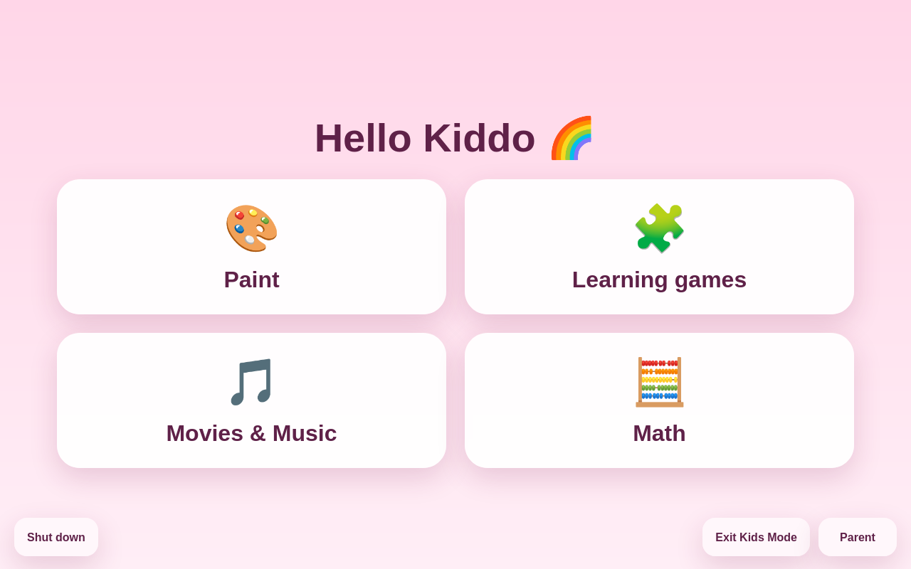
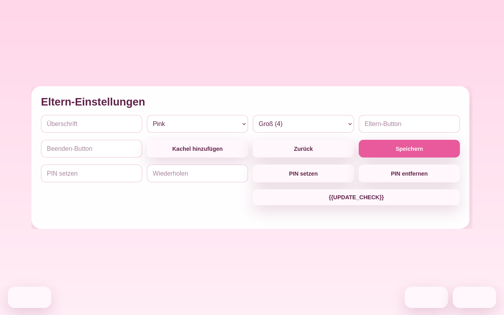
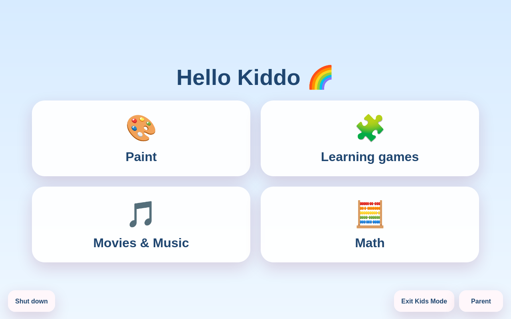

# Cozy Kids Launcher

> **Give your old laptop a new home as your kid's learning PC.**

Cozy Kids Launcher transforms any Linux computer into a child-friendly, fullscreen home screen — while keeping the normal desktop completely intact underneath for parents.

No locked-down environment. No cloud dependencies. No subscription. Just a simple, beautiful launcher that grows with your family.

---

## What it looks like

| Kids Home Screen | Parent Settings |
|---|---|
|  |  |

| Blue Theme | Desktop Shortcut |
|---|---|
|  | *(add your own desktop screenshot here)* |

---

## Quick start

**One line. Open a terminal, paste, press Enter.**

```bash
curl -fsSL https://raw.githubusercontent.com/TrissyGE/cozy-kids-launcher/main/scripts/install.sh | bash
```

Log out and back in — the launcher starts on its own. That's it.

**Recommended distros:** [Ubuntu](https://ubuntu.com/download), [Linux Mint](https://linuxmint.com/download.php), or [Zorin OS](https://zorin.com/os/) — all beginner-friendly, stable, and perfect for family computers.

For detailed install options and troubleshooting, see [docs/INSTALL.md](docs/INSTALL.md).

---

## Why this exists

Most kids launchers are either:

- mobile-first
- heavily locked-down
- outdated
- ugly
- or tied to a specific platform

**Cozy Kids Launcher takes a simpler approach:**

- The normal Linux desktop stays intact — you can still use the computer
- Kids see a friendly, fullscreen launcher with big, tappable tiles
- Parents can edit tiles, colors, and apps right inside the UI
- Everything stays local and understandable
- Works great on older hardware

---

## Features

| Feature | Status |
|---|---|
| Fullscreen kids home screen with large emoji tiles | ✅ |
| Dynamic pages with left/right navigation | ✅ |
| 4-tile (large) or 9-tile (compact) layout modes | ✅ |
| Parent settings inside the UI | ✅ |
| Editable title, colors, labels, and tiles | ✅ |
| 14 themes (5 colors + 9 illustrated worlds) | ✅ |
| Visual theme chooser with live previews | ✅ |
| PIN protection for parent settings | ✅ |
| Tile reordering (move up/down) | ✅ |
| App recommendations with one-click add | ✅ |
| Local app launching | ✅ |
| Exit back to desktop | ✅ |
| Safe shutdown button | ✅ |
| Desktop shortcut to reopen kids mode | ✅ |
| Automatic updates | ✅ |
| One-line installer | ✅ |
| German and English language support | ✅ |

---

## Demo flow

1. Child logs in
2. Fullscreen launcher opens automatically
3. Child taps an app tile
4. Parent taps **Parent** to customize tiles, colors, apps
5. Parent can exit back to desktop anytime
6. Parent can reopen kids mode from the desktop shortcut

---

## Recommended distros

Cozy Kids Launcher runs on any modern Linux desktop. For the smoothest experience on family hardware, we recommend:

| Distro | Why it fits |
|---|---|
| **[Ubuntu](https://ubuntu.com/download)** | Largest community, excellent hardware support, tons of educational software in the repos |
| **[Linux Mint](https://linuxmint.com/download.php)** | Familiar Windows-like interface, very stable, great for older laptops |
| **[Zorin OS](https://zorin.com/os/)** | Built to feel like Windows or macOS, lightweight editions for old hardware, education-focused |

All three have Firefox and Python pre-installed, so the launcher works out of the box.

---

## Mission

> **We believe every family deserves a safe, simple, and joyful computing experience for their children — without buying new hardware or surrendering privacy to the cloud.**
>
> Cozy Kids Launcher was born from a real family laptop setup. It is built the right way: by solving a real problem until the result became genuinely good. That is exactly why it feels different.
>
> If you have an old laptop gathering dust, give it a new purpose. Your child gets a learning PC. You get peace of mind. The planet gets less e-waste.

---

## Documentation

- [Installation guide](docs/INSTALL.md) — one-liner, manual install, options, troubleshooting
- [Architecture](docs/ARCHITECTURE.md) — how it works under the hood
- [Privacy & Safety](docs/PRIVACY.md) — local-first design and what parents should know
- [Roadmap](docs/ROADMAP.md) — what's done and what's coming next
- [Changelog](CHANGELOG.md) — version history

---

## Repository structure

```text
cozy-kids-launcher/
  README.md              # You are here
  LICENSE                # MIT
  VERSION                # Current version
  CHANGELOG.md           # What's new
  docs/
    INSTALL.md           # Installation guide
    ARCHITECTURE.md      # Technical overview
    PRIVACY.md           # Privacy & safety notes
    ROADMAP.md           # Future plans
    SCREENSHOTS.md       # Screenshot capture guide
  examples/
    config.example.json  # Example configuration
  scripts/
    install.sh           # One-line installer
    update.sh            # Standalone updater
    deploy.sh            # Release helper
  src/
    server.py            # Python HTTP server
    index.html           # Kids UI template
    no-media.html        # "No media found" page
    launcher.sh          # Runtime launcher script
    recommendations.json # Curated app recommendations
```

---

## License

MIT, see [LICENSE](LICENSE).

---

## Honest note

This project was not born as a polished product. It was built the right way: by solving a real family problem until the result became genuinely good. That is exactly why it feels different.
