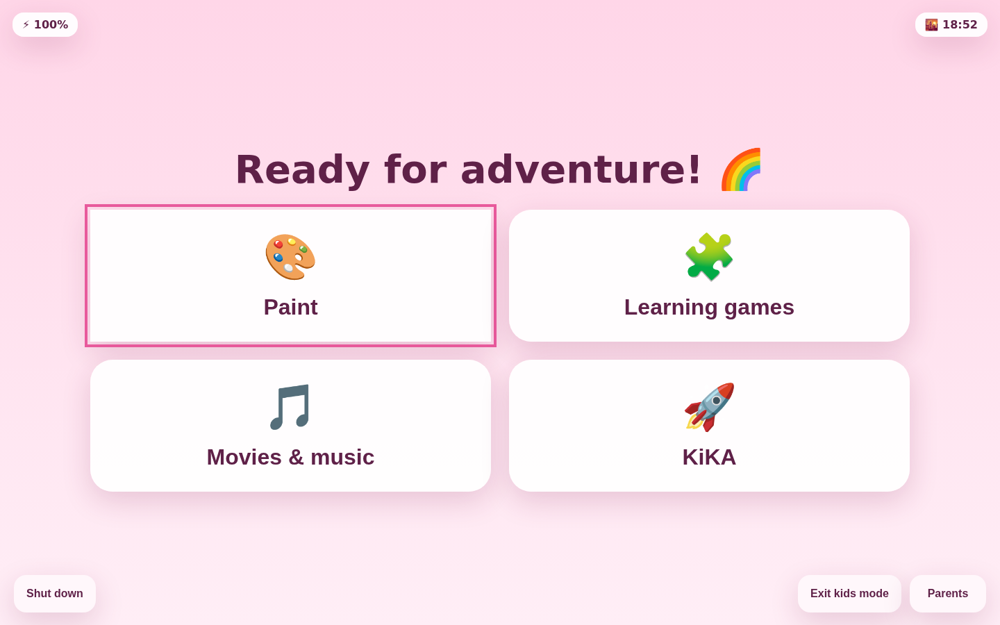
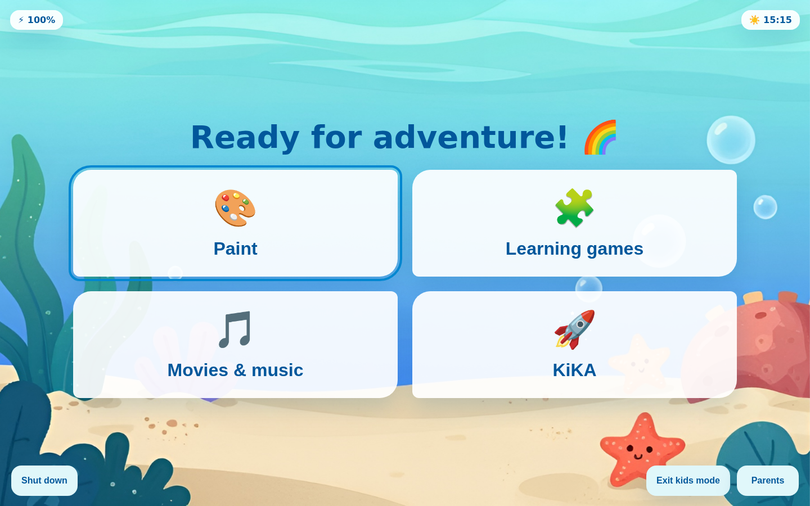
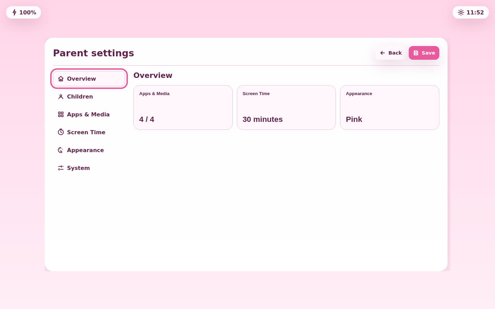
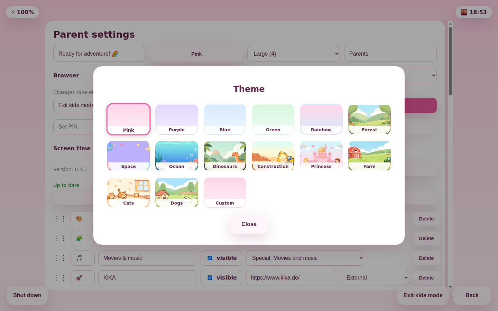

# Cozy Kids Launcher

[](https://github.com/TrissyGE/cozy-kids-launcher/releases/latest)
[](https://github.com/TrissyGE/cozy-kids-launcher/actions/workflows/ci.yml)
[](LICENSE)
[](docs/INSTALL.md)

**Turn an old Linux laptop into a friendly learning and media PC for kids—without taking the normal desktop away from parents.**

Cozy Kids Launcher is a local-first, fullscreen home screen with large tiles, parent settings, screen-time controls, themes, and unified launching for apps, websites, music, and videos. There is no account, cloud dependency, subscription, or locked-down replacement operating system.

[Install](#quick-start) · [Features](#highlights) · [Documentation](#documentation) · [Contribute](CONTRIBUTING.md)



## Quick start

On Ubuntu, Linux Mint, Zorin OS, or another modern desktop Linux:

```bash
curl -fsSL https://raw.githubusercontent.com/TrissyGE/cozy-kids-launcher/main/scripts/install.sh | bash
```

Log out and back in. The launcher then starts automatically. Python 3 and either Firefox or a Chromium-based browser are required; the installer checks the environment and explains missing dependencies.

See the [installation guide](docs/INSTALL.md) for language, browser, launch-mode, manual-install, and troubleshooting options.

## Highlights

- **Made for kids:** fullscreen interface, large touch-friendly tiles, keyboard navigation, multiple pages, and 4- or 9-tile layouts
- **Made for parents:** optional PIN, editable and reorderable tiles, configuration import/export and restore, privacy-safe diagnostics, desktop exit, and safe shutdown
- **Apps and media:** one consistent launch path for Linux apps, child-friendly websites, local music, and local video
- **Screen time:** timer controls, weekly and per-app schedules, remaining-time overlay, warning state, and PIN-protected block screens
- **Personal:** German and English interfaces, color themes, illustrated worlds, and a custom theme
- **Local-first:** configuration and browser profiles stay on the device
- **Safe updates:** immutable GitHub Releases, SHA-256 verification, downgrade protection, rollback, and compatibility with legacy installations

## More screenshots

| Illustrated world theme | Parent settings |
|---|---|
|  |  |

| Theme picker |
|---|
|  |

The screenshots use a clean, generated demo profile. Maintainers can recreate them with `python3 scripts/take-screenshots.py`; see the [screenshot guide](docs/SCREENSHOTS.md).

## How it fits together

```text
Kids UI in the browser
        │ localhost only
        ▼
Python launcher server ──► Linux apps / websites / VLC or MPV
        │
        ├──► parent session, settings, timer
        └──► local JSON configuration and release updater
```

The launcher is plain Python, HTML, CSS, JavaScript, and shell—there is no framework build step. Read the [architecture overview](docs/ARCHITECTURE.md) for the runtime and security boundaries.

## Documentation

| Guide | Purpose |
|---|---|
| [Installation](docs/INSTALL.md) | Install options, requirements, and troubleshooting |
| [Privacy and safety](docs/PRIVACY.md) | Local-first behavior and parent considerations |
| [Architecture](docs/ARCHITECTURE.md) | Components, data flow, and file locations |
| [Lifecycle](docs/LIFECYCLE.md) | Startup, logout, shutdown, update, and recovery states |
| [Development](docs/DEVELOPMENT.md) | Checks, WSLg testing, and manual smoke tests |
| [Desktop testing](docs/DESKTOP_TESTING.md) | Repeatable GNOME, KDE Plasma, and XFCE release matrix |
| [Display behavior](docs/DISPLAY_BEHAVIOR.md) | X11/Wayland focus, overlay, and kiosk guarantees |
| [Branching](docs/BRANCHING.md) | Branch responsibilities and pull-request flow |
| [Releasing](docs/RELEASING.md) | Versioning, immutable artifacts, and updater compatibility |
| [Roadmap](docs/ROADMAP.md) | Completed work and future ideas |
| [Changelog](CHANGELOG.md) | Published changes |

## Development

Everyday work targets `develop`; `main` is reserved for the exact commit of the latest stable release because legacy updaters consume it directly.

```bash
git switch develop
git switch -c feature/short-description
python3 -m unittest discover -s tests -v
```

Open feature, fix, and documentation pull requests against `develop`. The complete branch lifecycle, including releases and hotfixes, is defined in [docs/BRANCHING.md](docs/BRANCHING.md); setup and review expectations are in [CONTRIBUTING.md](CONTRIBUTING.md).

## Mission

Every family should be able to turn existing hardware into a simple, joyful learning computer without surrendering privacy or buying another device.

## License

[MIT](LICENSE)
